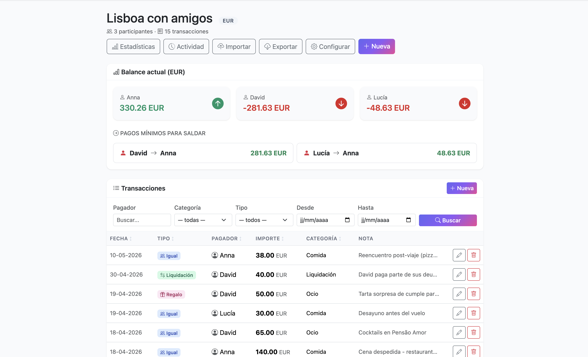

# Wisenomy

> 🌍 Read this in [Español](README.es.md) · [Français](README.fr.md)

**A Splitwise alternative you can read in an afternoon.**
No frameworks. No Composer. No Node. No build step. ~3.500 lines of PHP that do the whole job.


🚀 **Live demo:** [wisenomy.app](https://wisenomy.app) · 🐳 **Self-host:** `docker compose up`

<p align="center">
  
</p>

---

## Why this exists

Modern web apps demand a lot — npm install, transpilers, ORMs, three layers of bundlers. Wisenomy makes the opposite bet:

- **Zero dependencies at runtime.** No `vendor/`, no `node_modules/`. The whole codebase is `git clone` away.
- **Single language end to end.** PHP for routing, persistence, templating. No context switching, no JS framework.
- **Two days to fork it confidently.** ~3.500 LoC total. Any PHP developer can audit the security, understand the data model, and ship a custom feature without reading docs.
- **Hostable for €14/year.** Cloudflare DNS (free) + Railway PHP+Postgres ($5/month) + Resend transactional emails (3.000/month free) + your dominio.
- **Durable choices.** SQLite for development, PostgreSQL for production, raw SQL via PDO, server-rendered HTML, Bootstrap from CDN. Tech that will still work in 2036.

It's not the answer for every project. It is the answer when you want to *own* the stack instead of borrow it.

---

## Quick start

### Self-host with Docker (the easy way)

```bash
git clone https://github.com/Alespfer/wisenomy.git
cd wisenomy
docker compose up -d
open http://localhost:8080
```

That brings up PHP 8.4 + PostgreSQL with persistent volumes. Stop with `docker compose down`.

### Run locally without Docker

Requires PHP 8.1+ with PDO SQLite (bundled by default).

```bash
git clone https://github.com/Alespfer/wisenomy.git
cd wisenomy
php -S localhost:8000
```

SQLite database auto-creates in `data/app.sqlite` on first request.

### MAMP / XAMPP

Drop the folder into `htdocs/` and visit `http://localhost:8888/wisenomy/`.

---

## Features

### Expense management
- **5 transaction types**: equal split, custom shares, full charge to one person, gift, settlement.
- **Minimum-payment settlement algorithm** — greedy reduction of mutual debts.
- **30+ currencies** with live FX from the ECB ([Frankfurter API](https://frankfurter.dev)) — cached 12h with stale fallback.
- **Integer-cents arithmetic** — no floating-point rounding errors, ever.
- **EUR subtitle** under non-EUR amounts for quick reference.

### Groups & collaboration
- **Multi-user** with strict per-user data isolation.
- **Group ownership transfer** to another member.
- **Invite by link** with configurable TTL and max-uses, revocable.
- **Invite by email** for pre-registered users.

### Visibility
- **Activity feed** per group, paginated.
- **Statistics** by category, payer and month with date-range filter.
- **Sortable transactions table** with filters by payer, category, type and date.
- **30-per-page pagination** for groups with long history.

### Data portability
- **CSV export/import** for all 5 transaction types — UTF-8 with BOM for Excel.
- **Roundtrip-safe**: export → import yields identical data.

### Account & security
- Strong password policy: 8+ chars, uppercase, lowercase, digit, special.
- **bcrypt** hashes, **CSRF** tokens on every POST, **rate limiting** (5 fails / 15 min).
- Session cookies `HttpOnly` + `SameSite=Lax` + `Secure` over HTTPS.
- Security headers: CSP, X-Frame-Options, HSTS, Referrer-Policy.
- **Email verification** on registration.
- Password reset via tokenized one-time link.
- **GDPR-friendly account deletion** with cascade and pre-deletion summary.

---

## Project structure

```
wisenomy/
├── index.php             # Front controller / router
├── schema.sql            # SQLite schema (auto-applied on first request)
├── schema.postgres.sql   # PostgreSQL schema (used when DATABASE_URL is set)
├── lib/
│   ├── config.php        # env() helper + proxy/HTTPS detection
│   ├── db.php            # PDO bootstrap, driver detection, SQL helpers
│   ├── auth.php          # Registration, login, sessions, CSRF, email verify
│   ├── mail.php          # Resend API integration with dev fallback
│   ├── repo.php          # CRUD + stats
│   ├── currency.php      # Frankfurter FX with caching
│   ├── settlement.php    # Debt-minimization algorithm
│   ├── csv.php           # Import / export
│   ├── invites.php       # Group invitation links
│   └── activity.php      # Group activity log
├── views/                # Templates (one file per route)
├── data/                 # SQLite + logs (gitignored)
├── Dockerfile            # Single-stage image
└── docker-compose.yml    # App + PostgreSQL
```

---

## Configuration

The app works with zero configuration in development (SQLite + mail to file). For production, set environment variables (see [`.env.example`](.env.example)):

| Variable | Purpose |
|---|---|
| `APP_ENV` | `production` silences error display, `development` shows them |
| `APP_URL` | Canonical URL used in outbound email links |
| `TRUST_PROXY` | Set to `1` behind Cloudflare/Railway to honour `X-Forwarded-*` |
| `DATABASE_URL` | When set, app uses PostgreSQL instead of SQLite |
| `RESEND_API_KEY` | When set, emails go through [Resend](https://resend.com); else logged to `data/mail.log` |
| `MAIL_FROM` | Sender address (must be on a domain verified at Resend) |
| `REQUIRE_EMAIL_VERIFICATION` | `0` to disable mandatory email verification |

---

## How the live instance is deployed

[`wisenomy.app`](https://wisenomy.app) runs on:

- **App + PostgreSQL**: [Railway](https://railway.com) (~$5/month).
- **Emails**: [Resend](https://resend.com) (3.000 emails/month free).
- **DNS, HTTPS, CDN, WAF**: [Cloudflare](https://cloudflare.com) (free).

Total cost: ~$5/month + €14/year for the domain. You can replicate the stack for any hobby project with the same numbers.

---

## Roadmap

- [ ] Two-factor authentication (TOTP).
- [ ] Multi-language UI (currently Spanish only).
- [ ] Automated PostgreSQL backups to S3/R2.
- [ ] Native mobile app (the web is already responsive).
- [ ] Activity-feed export to PDF.

---

## Contributing

Pull requests welcome. For larger changes, open an issue first to discuss direction.

- **Bugs and feature requests**: open an issue.
- **Security vulnerabilities**: see [SECURITY.md](SECURITY.md) — please report privately.
- **Code style**: stick to the LAGOM doctrine — small, explicit, dependency-free.

---

## License

[MIT](LICENSE) — do whatever you want, no warranty.
If you fork it and deploy publicly, please rename your fork to avoid confusion with the original.

---

## Acknowledgments

- [Frankfurter](https://frankfurter.dev) — free exchange rates from the European Central Bank.
- [Bootstrap](https://getbootstrap.com) — UI framework.
- [Bootstrap Icons](https://icons.getbootstrap.com) — icon set.
- [Resend](https://resend.com) — transactional email API with a generous free tier.
